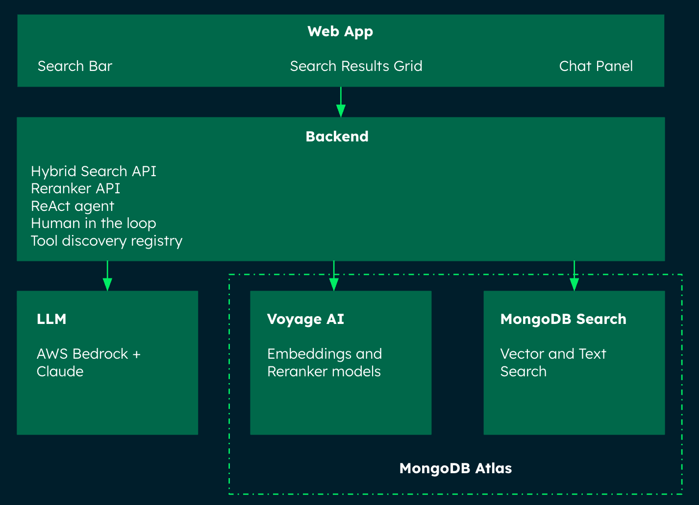

# Multimodal Event Explorer

A MongoDB-powered demo that lets you explore a dataset of autonomous driving events through natural language search and a conversational AI agent. Users can search by scene description, filter by weather, season, or time of day, and interact with a ReAct-based AI agent backed by AWS Bedrock (Claude 3) that reasons over the database in real time.

## Where MongoDB Shines?

- **Atlas Vector Search with Scalar Quantization** — image embeddings (1024-dim, Voyage AI) are stored as `float32` in documents and compressed to `int8` at the index layer, reducing memory footprint by ~75% with ~99% recall preserved.
- **Hybrid Search via `$rankFusion`** — combines vector search and full-text Atlas Search with Reciprocal Rank Fusion in a single aggregation pipeline, no application-side merging needed.
- **`$facet` aggregations** — the AI agent uses a single `$facet` pipeline to compute weather, season, and time-of-day distributions across the entire collection in one round-trip.
- **Flexible document model** — each event stores raw image bytes, a text description, metadata fields, and a vector embedding in one document, eliminating joins.

## High Level Architecture



## Tech Stack

- [Next.js 15](https://nextjs.org/docs/app) (App Router) for the frontend
- [MongoDB Atlas](https://www.mongodb.com/atlas/database) — Vector Search, Atlas Search, aggregations
- [FastAPI](https://fastapi.tiangolo.com/) for the Python backend
- [AWS Bedrock](https://aws.amazon.com/bedrock/) — Claude 3 Haiku for the AI agent
- [Voyage AI](https://www.voyageai.com/) — `voyage-multimodal-3.5` for embeddings, `rerank-2` for reranking
- [uv](https://docs.astral.sh/uv/) for Python dependency management
- [LeafyGreen UI](https://www.mongodb.design/) for MongoDB-branded React components

## Dataset

The demo requires image data in MongoDB before it can run searches or chat with the agent. You have two options.

---

### Option 1 — Use the MIST dataset (recommended)

The demo was built and tested against the **MIST Autonomous Driving Dataset** on HuggingFace:

> 🤗 [jongwonryu/MIST-autonomous-driving-dataset](https://huggingface.co/datasets/jongwonryu/MIST-autonomous-driving-dataset)

The dataset contains dashcam frames labelled with driving conditions (season, weather, time of day). The full dataset is ~73 GB, but **you do not need to download it all**. The ingestion pipeline uses HuggingFace streaming and a diversity-gating mechanism to pull only the images you need.

**Run the pipeline from the `backend/` directory:**

```bash
# Recommended — 1 000 diverse images (streams ~1–2 GB, takes ~15–30 min)
uv run python services/ingestion_pipeline.py --sample-size 1000

# Lightweight smoke-test — 100 images
uv run python services/ingestion_pipeline.py --sample-size 100
```

The pipeline will:
1. Stream images from HuggingFace (no full download required)
2. Apply diversity gating — caps each weather/season/time-of-day combination so you get a balanced sample across conditions
3. Save images locally to `backend/data/images/adas/`
4. Generate multimodal embeddings via Voyage AI (`voyage-multimodal-3.5`)
5. Insert documents and create Vector Search + Atlas Search indexes in MongoDB

**Optional — preview which conditions will be sampled before touching any images:**

```bash
uv run python check_diversity.py
```

This loads only the `text` column (no images) and prints a breakdown of conditions, so you can verify variety before running the full pipeline.

---

### Option 2 — Bring your own dataset

You can adapt the pipeline to any HuggingFace image dataset that has at least one image column and optionally a text/caption column.

**Step 1 — Point the loader at your dataset**

Edit `backend/services/dataset_loader.py`, change the default `dataset_id`:

```python
class DatasetLoader:
    def __init__(
        self,
        dataset_id: str = "your-org/your-dataset",   # ← change this
        ...
    ):
```

Or pass it at runtime (edit `IngestionPipeline.__init__` to forward a `dataset_id` argument).

**Step 2 — Adapt the metadata extraction**

The normalizer (`backend/services/event_normalizer.py`) scans text fields for known keywords:

```python
SEASONS      = ["spring", "summer", "fall", "winter", "autumn"]
TIMES_OF_DAY = ["dawn", "day", "dusk", "night", "daytime"]
WEATHER_CONDITIONS = ["clear", "cloudy", "rainy", "foggy", "snowy", "overcast"]
```

If your dataset uses different labels, update these lists and the `parse_metadata_from_text` method. If your dataset has no text labels at all, the fallback logic will assign metadata deterministically from the source index — the demo will still work, but search filters will reflect synthetic labels.

**Step 3 — Run the pipeline**

```bash
uv run python services/ingestion_pipeline.py --sample-size 500
```

**Minimum requirements for a custom dataset:**

| Requirement | Details |
|---|---|
| At least one image column | Any PIL-compatible image (JPEG, PNG, etc.) |
| HuggingFace `datasets` compatible | Public dataset or private with `HF_TOKEN` set |
| Text / caption column (optional) | Used for full-text search and metadata extraction; falls back to synthetic labels if absent |

---

## Image Storage

After ingestion, images are saved to `backend/data/images/adas/` and served directly by the backend. This works fine for local development.

For shared or deployed environments, you can migrate images to S3 + CloudFront instead. The app automatically uses the `image_url` field stored in MongoDB when it is present, so no code changes are needed — just run the migration.

**Option A — Local (default)**

No extra setup. Images are served from the backend filesystem.

**Option B — S3 + CloudFront**

1. Create the S3 bucket (edit the variables at the top of the script to match your AWS account and region):
   ```bash
   bash scripts/create-s3-buckets-simple.sh
   ```

2. Upload images and update MongoDB from the `backend/` directory:
   ```bash
   uv run python services/s3_migration.py
   ```
   This uploads each image, and writes the CloudFront URL back to `image_url` in each MongoDB document.

3. Add to `backend/.env`:
   ```env
   S3_BUCKET_NAME=your-bucket-name
   S3_REGION=us-east-1
   CLOUDFRONT_DOMAIN=your-cf-domain.cloudfront.net
   ```

---

## Prerequisites

Before you begin, ensure you have met the following requirements:

- Python 3.13 (but less than 3.14)
- Node.js 22 or higher
- uv (install via [uv's official documentation](https://docs.astral.sh/uv/getting-started/installation/))
- A [MongoDB Atlas](https://www.mongodb.com/atlas) cluster with the ADAS collection loaded and Vector Search + Atlas Search indexes created
- A [Voyage AI](https://www.voyageai.com/) API key
- AWS credentials configured locally with access to Bedrock (Claude 3 Haiku)

## Run it Locally

### Backend

1. Copy the example environment file and fill in your credentials:
   ```bash
   cp backend/.env.example backend/.env
   ```
   Edit `backend/.env` with your values:
   ```env
   MONGODB_URI=<your-atlas-connection-string>
   DATABASE_NAME=multimodal_explorer
   VOYAGE_API_KEY=...
   AWS_REGION=us-east-1
   AWS_PROFILE=<your-aws-sso-profile>   # omit if using instance role / IRSA
   ```

2. Open the project in your preferred IDE (Visual Studio Code recommended).
3. Open the terminal and ensure you are in the root project directory where the `makefile` is located.
4. Install Python dependencies:
   - uv initialization
     ```bash
     make uv_init
     ```
   - uv sync
     ```bash
     make uv_sync
     ```
5. Verify that the `.venv` folder has been generated within the `/backend` directory.

### Running Backend Locally

After setting up the backend dependencies, you can run the development server:

1. Navigate to the backend directory:
   ```bash
   cd backend
   ```

2. Start the FastAPI development server:
   ```bash
   uv run uvicorn main:app --host 0.0.0.0 --port 8000
   ```

3. The backend API will be accessible at http://localhost:8000. You can verify it is running at http://localhost:8000/docs (Swagger UI).

**Note**: If port 8000 is already in use (e.g., by Docker containers), either stop the containers with `make clean` or use a different port like `--port 8001`.

### Frontend

1. Copy the example environment file:
   ```bash
   cp frontend/EXAMPLE.env frontend/.env.local
   ```
   The default value points to the local backend — no changes needed for local development:
   ```env
   NEXT_PUBLIC_API_URL=http://localhost:8000
   ```

2. Navigate to the `frontend` folder and install dependencies:
   ```bash
   cd frontend
   npm install
   ```

3. Start the frontend development server:
   ```bash
   npm run dev
   ```

4. The frontend will be accessible at http://localhost:3000.

## Run with Docker

Make sure to run this from the root directory. The Docker Compose setup mounts your local AWS credentials so the backend can reach Bedrock without static keys.

1. Build and start both containers:
   ```bash
   make build
   ```
2. To stop and remove the containers and images:
   ```bash
   make clean
   ```

## Common errors

### Backend

- **Missing `.env` file** — copy `backend/.env.example` to `backend/.env` and fill in all required values (`MONGODB_URI`, `VOYAGE_API_KEY`, AWS config).
- **AWS auth errors** — ensure your AWS SSO session is active (`aws sso login --profile <profile>`) or that the machine has an IAM role with Bedrock access.
- **MongoDB connection refused** — confirm your Atlas cluster IP allowlist includes your current IP address (or `0.0.0.0/0` for development).
- **Vector search index not found** — the Atlas Vector Search and Atlas Search indexes must be created before running the app. Refer to the index definitions in `backend/services/mongodb_service.py`.

### Frontend

- **`NEXT_PUBLIC_API_URL` not set** — copy `frontend/EXAMPLE.env` to `frontend/.env.local`. Without this the frontend cannot reach the backend.
- **CORS errors in browser** — ensure the `ORIGINS` variable in `backend/.env` includes `http://localhost:3000`.